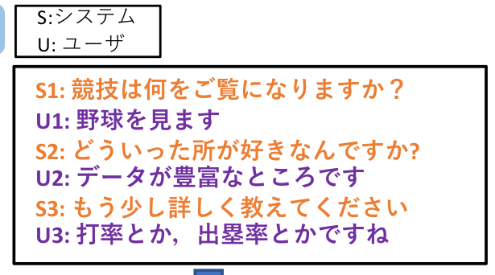
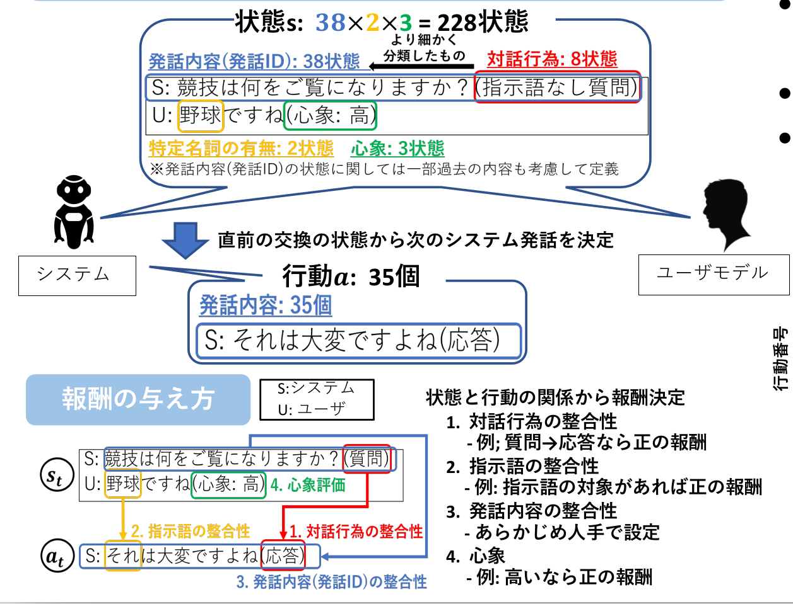

# 聞き役対話システムNH-chat
ユーザの話の聞き役となるようなマルチモーダル対話システム．ユーザの音声と顔画像を入力として、予め用意した発話集合から状況に応じた質問やリアクションを返す．

## 設計
主に，
- ユーザの音声認識を行う部分(音声→テキスト)
- 表情、韻律からユーザの心象を推定する部分(表情、韻律→心象)
- 状況に応じた発話を選択する部分(テキスト、心象→発話)

に分かれる．
### 音声認識部(/NH_chat内、非公開)
Google Cloud Speech to Textを用いてユーザ音声をテキストに変換する．
### 心象推定部(/NH_chat内、非公開)
OpenFaceを用いて顔画像特徴、openSMILEを用いて韻律特徴を取得し、学習済みSVMモデルに入力して1〜7の心象を得る．
### 発話選択部(/Select_sys_utt内)
深層強化学習の手法の一種である、Deepc Q Networkを用いた学習モデルに、システム発話履歴(テキスト)、ユーザ発話(テキスト)と心象を入力し、適切な発話選択を得る．

